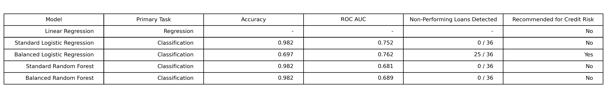
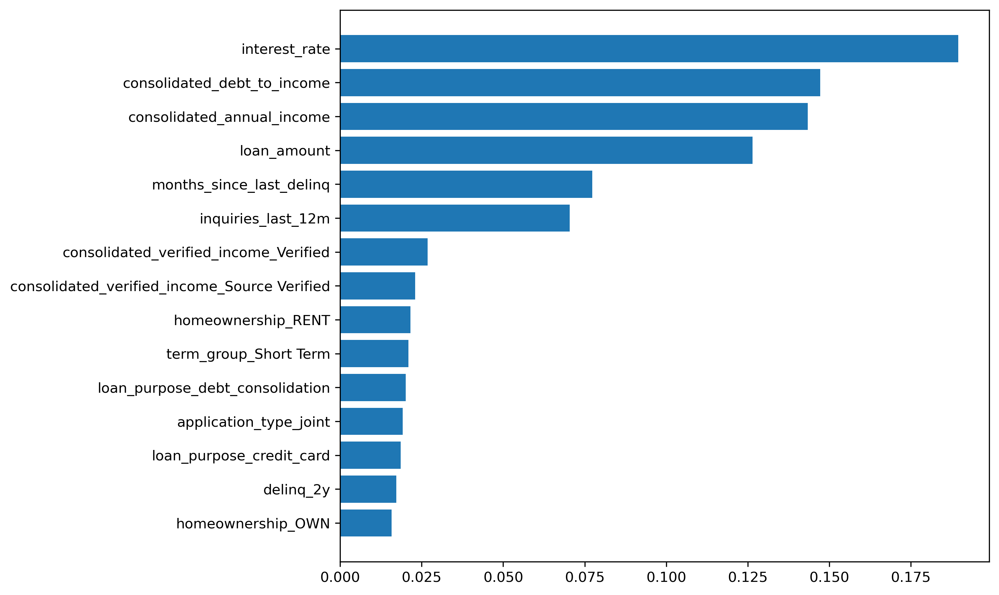
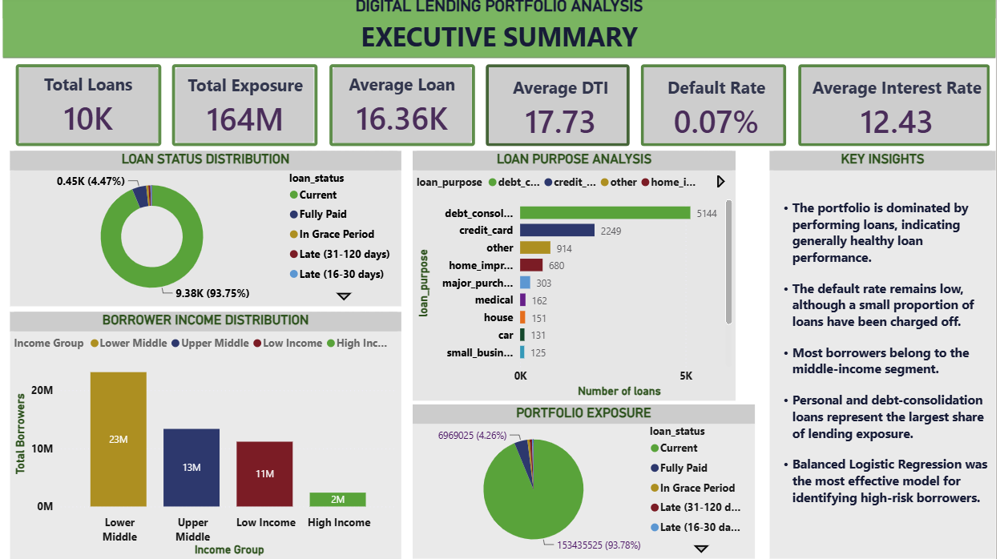
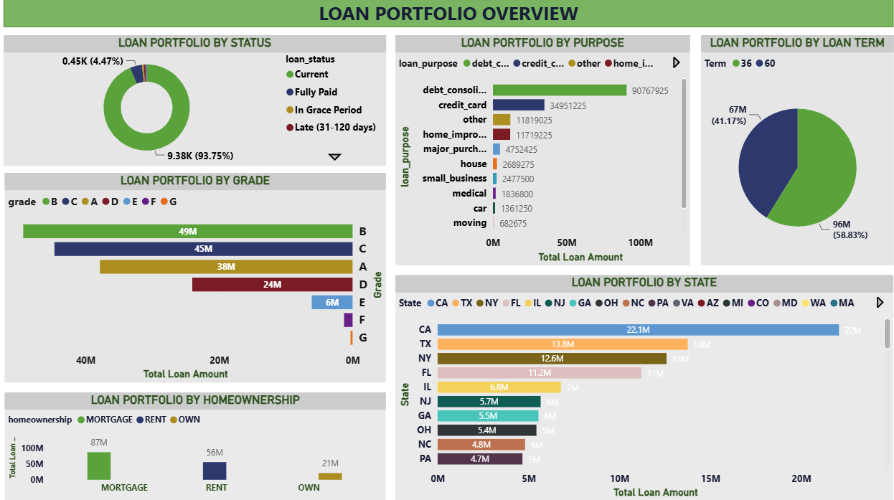
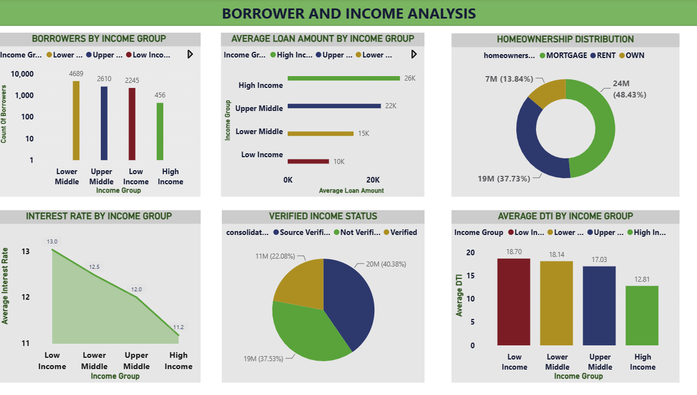
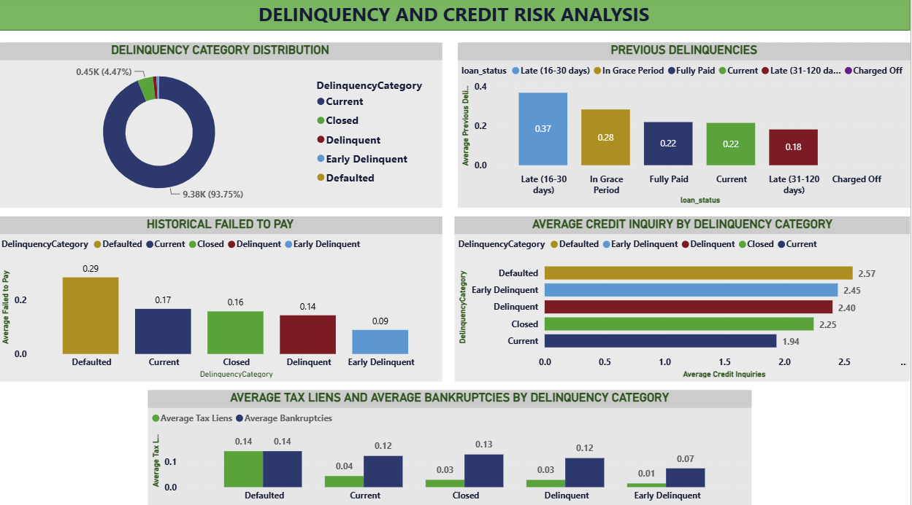
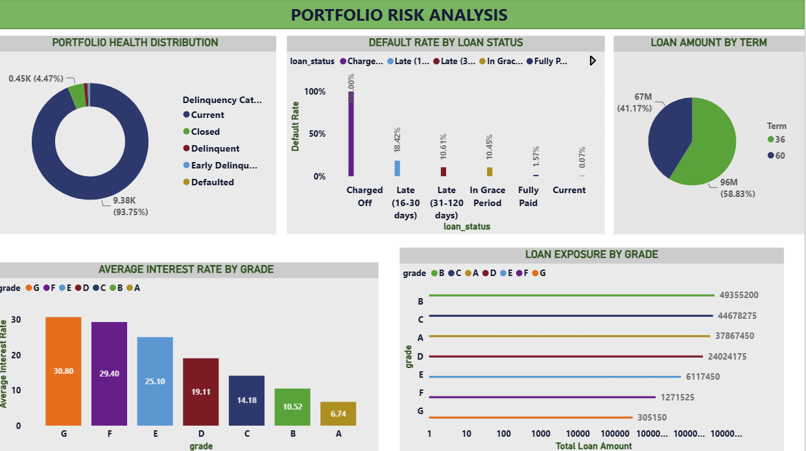
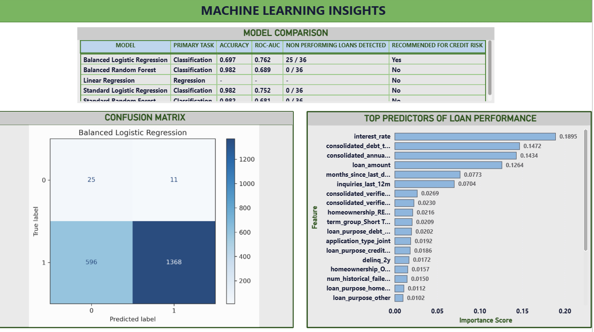

# 📊 Loan Performance and Credit Risk Analysis


---

## 📖 Project Overview

This project presents an end-to-end **Loan Performance and Credit Risk Analysis** solution that combines **SQL**, **Python**, **Machine Learning**, and **Power BI** to evaluate borrower risk, analyze loan performance, and generate actionable business insights.

The project follows the complete analytics lifecycle—from raw data preparation to predictive modeling and interactive dashboard development—demonstrating how data-driven decision-making can support lending institutions in reducing credit risk and improving portfolio performance.

The workflow includes:

- Data Cleaning & Preparation
- SQL Business Analysis
- Exploratory Data Analysis (EDA)
- Machine Learning Model Development
- Model Evaluation & Comparison
- Power BI Dashboard Development
- Business Insights & Recommendations

---

# 📑 Table of Contents

- [Business Problem](#-business-problem)
- [Project Objectives](#-project-objectives)
- [Technology Stack](#-technology-stack)
- [Repository Structure](#-repository-structure)
- [Dataset Overview](#-dataset-overview)
- [Data Cleaning & Preparation](#-data-cleaning--preparation)
- [SQL Analysis](#-sql-analysis)
- [Python Analysis](#-python-analysis)
- [Machine Learning](#-machine-learning)
- [Model Performance](#-model-performance)
- [Power BI Dashboard](#-power-bi-dashboard)
- [Dashboard Screenshots](#-dashboard-screenshots)
- [Key Business Insights](#-key-business-insights)
- [Business Recommendations](#-business-recommendations)
- [Installation Guide](#-installation-guide)
- [Repository Contents](#-repository-contents)
- [Future Improvements](#-future-improvements)
- [Author](#-author)

---

# 🎯 Business Problem

Financial institutions process thousands of loan applications while balancing two competing objectives:

- Maximizing loan approvals to increase revenue.
- Minimizing default risk to protect profitability.

Traditional lending decisions based solely on credit scores often fail to capture broader borrower characteristics such as income stability, debt burden, loan purpose, repayment history, and verification status.

This project investigates these factors to answer key business questions:

- Which borrower characteristics are associated with higher credit risk?
- Which loan segments contribute most to portfolio risk?
- Can machine learning improve the identification of high-risk borrowers?
- How can interactive dashboards support faster and more informed lending decisions?

---

# 🚀 Project Objectives

The objectives of this project are to:

- Clean and prepare raw lending data for analysis.
- Explore borrower demographics and loan characteristics.
- Perform SQL-based business intelligence analysis.
- Analyze delinquency trends and portfolio health.
- Identify key drivers of loan performance.
- Build predictive machine learning models for credit risk classification.
- Compare model performance using multiple evaluation metrics.
- Develop an interactive Power BI dashboard for executive decision-making.
- Generate business recommendations based on analytical findings.

---

# 🛠 Technology Stack

| Technology | Purpose |
|------------|---------|
| **SQL (MySQL)** | Data extraction, transformation and business analysis |
| **Python** | Data analysis, visualization and machine learning |
| **Pandas** | Data manipulation |
| **NumPy** | Numerical computing |
| **Matplotlib** | Data visualization |
| **Scikit-learn** | Machine learning models |
| **Power BI** | Interactive business dashboards |
| **Excel** | Initial data cleaning and validation |
| **Git & GitHub** | Version control and project hosting |

---

# 📂 Repository Structure

```text
Loan-Performance-and-Credit-Risk-Analysis
│
├── data/
│   ├── clean_loanset.csv
│   └── raw dataset
│
├── documentation/
│   └── Project documentation
│
├── images/
│   ├── Dashboard screenshots
│   ├── Model comparison
│   ├── Feature importance
│   ├── Confusion matrices
│   └── Analytical visualizations
│
├── power bi/
│   └── Loan Performance Risk Analysis.pbix
│
├── presentation/
│   └── Loan Performance Risk Analysis Presentation.pptx
│
├── python/
│   ├── 01_data_loading.ipynb
│   ├── 02_correlation_analysis.ipynb
│   ├── 03_linear_regression.ipynb
│   ├── 04_balanced_logistic_regression.ipynb
│   ├── 05_standard_logistic_regression.ipynb
│   ├── 06_balanced_random_forest.ipynb
│   ├── 07_standard_random_forest.ipynb
│   ├── 08_feature_importance.ipynb
│   └── 09_model_comparison.ipynb
│
├── sql/
│   ├── 01_data_setup.sql
│   ├── 02_data_cleaning.sql
│   ├── 03_business_queries.sql
│   ├── 04_exploratory_analysis.sql
│   ├── 05_income_analysis.sql
│   ├── 06_delinquency_analysis.sql
│   └── 07_portfolio_risk_analysis.sql
│
├── README.md
└── requirements.txt
```

# 📊 Dataset Overview

The analysis uses a historical consumer lending dataset containing borrower demographics, loan characteristics, repayment history, and loan performance information.

The dataset was prepared to support both **business intelligence reporting** and **machine learning classification**.

### Dataset Highlights

- Thousands of historical loan records
- Borrower demographic information
- Employment details
- Income verification status
- Credit history
- Delinquency history
- Loan purpose
- Interest rates
- Loan performance status

### Key Variables

| Category | Examples |
|----------|----------|
| Borrower | Annual Income, Employment Length, Home Ownership |
| Credit Profile | Debt-to-Income Ratio, Delinquencies, Credit Inquiries |
| Loan Information | Loan Amount, Interest Rate, Loan Purpose, Loan Term |
| Target Variable | Loan Status (Performing vs Non-Performing) |

---  

# 🧹 Data Cleaning & Preparation

Before analysis, the dataset underwent a comprehensive cleaning and preprocessing workflow to improve consistency, quality, and analytical reliability.

### Cleaning Process

✔ Removed duplicate records

✔ Handled missing values

✔ Standardized variable names

✔ Consolidated borrower income variables

✔ Consolidated debt-to-income variables

✔ Standardized income verification categories

✔ Encoded categorical variables for machine learning

✔ Verified data integrity before modeling

### Feature Engineering

Several derived variables were created to improve analytical performance, including:

- Consolidated Annual Income
- Consolidated Debt-to-Income Ratio
- Consolidated Income Verification Status
- Loan Performance Classification
- Loan Term Groups
- One-Hot Encoded Categorical Variables

These transformations improved both SQL analysis and machine learning model performance.

---

# 🗄 SQL Business Analysis

SQL was used to explore borrower behavior, portfolio performance, and credit risk from a business perspective.

The analysis was divided into multiple business-focused modules.

### SQL Modules

| Script | Purpose |
|---------|---------|
| Data Setup | Database creation and import |
| Data Cleaning | SQL preprocessing |
| Business Queries | Portfolio summaries |
| Exploratory Analysis | Borrower exploration |
| Income Analysis | Income segmentation |
| Delinquency Analysis | Credit risk analysis |
| Portfolio Risk Analysis | Lending portfolio assessment |

### Business Questions Answered

- What is the overall portfolio performance?
- Which income groups receive the largest loans?
- How does income affect borrowing behavior?
- Which borrowers exhibit the highest credit risk?
- Which loan purposes are associated with higher default risk?
- How do delinquency patterns affect portfolio quality?

---

# 🐍 Python Analysis

Python was used to perform exploratory data analysis, statistical analysis, predictive modeling, and visualization.

The notebooks follow a structured workflow from raw data exploration through machine learning model evaluation.

### Python Workflow

1. Data Loading
2. Correlation Analysis
3. Linear Regression
4. Balanced Logistic Regression
5. Standard Logistic Regression
6. Balanced Random Forest
7. Standard Random Forest
8. Feature Importance Analysis
9. Model Comparison

### Exploratory Data Analysis

The exploratory analysis examined relationships between borrower characteristics and loan performance using:

- Correlation Heatmaps
- Scatter Plots
- Regression Analysis
- Feature Correlation
- Distribution Analysis

These analyses identified important relationships between borrower income, debt burden, loan amount, and credit risk before predictive modeling.

---

# 🤖 Machine Learning

The objective of the machine learning phase was to develop predictive models capable of identifying **non-performing loans** before default occurs.

Given the highly imbalanced nature of the dataset, multiple classification models were evaluated to determine which algorithm provided the best balance between predictive performance and the ability to detect high-risk borrowers.

---

# 🔄 Machine Learning Workflow

The modeling process followed these steps:

1. Data preprocessing and feature engineering
2. Categorical variable encoding
3. Train-test split
4. Model training
5. Model evaluation
6. Performance comparison
7. Feature importance analysis
8. Business interpretation

---

# 🧠 Models Evaluated

The following models were developed and compared:

| Model | Purpose |
|--------|---------|
| Linear Regression | Baseline relationship analysis |
| Standard Logistic Regression | Binary classification baseline |
| Balanced Logistic Regression | Class imbalance handling |
| Standard Random Forest | Tree-based classification |
| Balanced Random Forest | Ensemble classification with balanced sampling |

---

# 📊 Model Performance Comparison

The table below summarizes the performance of all evaluated models.



---

# 📈 Model Evaluation Summary

| Model | Accuracy | ROC-AUC | Non-Performing Loans Detected | Recommended |
|--------|---------:|--------:|------------------------------:|:-----------:|
| Standard Logistic Regression | 98.2% | 0.752 | 0 / 36 | ❌ |
| **Balanced Logistic Regression** | **69.7%** | **0.762** | **25 / 36** | ✅ |
| Standard Random Forest | 98.2% | 0.681 | 0 / 36 | ❌ |
| Balanced Random Forest | 98.2% | 0.689 | 0 / 36 | ❌ |

---

# 🎯 Model Selection

Although the Standard Logistic Regression and Random Forest models achieved very high accuracy (98.2%), they failed to identify any non-performing loans.

This occurred because the dataset is highly imbalanced, with performing loans greatly outnumbering non-performing loans. As a result, these models learned to predict almost every loan as performing, producing misleadingly high accuracy.

The **Balanced Logistic Regression** model was selected as the preferred credit risk model because it successfully detected **25 of the 36** non-performing loans while achieving the highest ROC-AUC score (0.762). This demonstrates a better ability to identify risky borrowers, which is more valuable for lending decisions than overall accuracy alone.

> **Key takeaway:** In credit risk prediction, the ability to correctly identify high-risk borrowers is more important than achieving high overall accuracy.

---

# 🌲 Feature Importance

To understand the factors driving loan performance, a Random Forest model was used to estimate feature importance.

Although the Random Forest models were not selected as the final predictive model, they provided valuable insights into the variables that most strongly influence loan performance.



---

# 🔍 Key Predictive Features

The analysis identified the following variables as the strongest predictors of loan performance:

| Rank | Feature |
|------:|---------|
| 1 | Interest Rate |
| 2 | Consolidated Debt-to-Income Ratio |
| 3 | Consolidated Annual Income |
| 4 | Loan Amount |
| 5 | Months Since Last Delinquency |
| 6 | Credit Inquiries (Last 12 Months) |

These findings indicate that both borrower financial health and loan characteristics significantly influence repayment performance.

---

# 📌 Machine Learning Insights

The modeling process produced several important insights:

- High model accuracy does not necessarily indicate good credit risk detection.
- Addressing class imbalance significantly improved the identification of risky borrowers.
- Interest rate was the most influential variable affecting loan performance.
- Debt-to-income ratio and annual income were strong indicators of borrower risk.
- Borrowers with recent delinquency history and frequent credit inquiries exhibited higher risk profiles.
- Balanced Logistic Regression provided the best trade-off between predictive performance and business usefulness.

---

# 💼 Business Value

The selected model can support lending institutions by:

- Identifying high-risk borrowers before loan approval.
- Supporting risk-based lending strategies.
- Improving portfolio monitoring.
- Reducing potential loan defaults.
- Enhancing data-driven credit decision-making.

---

---# 📊 Power BI Dashboard

To complement the SQL analysis and machine learning models, an interactive **Power BI dashboard** was developed to provide business stakeholders with an intuitive view of portfolio performance, borrower characteristics, and credit risk.

The dashboard enables users to:

- Monitor overall portfolio health.
- Analyze borrower demographics and income distribution.
- Identify delinquency trends.
- Assess portfolio risk.
- Explore machine learning insights.
- Support data-driven lending decisions.

---

# 🖼 Dashboard Preview

## Executive Summary

Provides a high-level overview of the loan portfolio, including key performance indicators such as total exposure, average interest rate, average borrower income, and portfolio composition.



---

## Loan Portfolio Overview

Analyzes the distribution of loans across loan status, loan purpose, loan term, and portfolio composition.



---

## Borrower & Income Analysis

Explores borrower demographics and financial characteristics, highlighting income segmentation, loan amount distribution, and borrowing behavior.



---

## Delinquency & Credit Risk Analysis

Examines borrower repayment behavior by analyzing delinquency history, default patterns, and key indicators of credit risk.



---

## Portfolio Risk Analysis

Provides insights into portfolio exposure, loan concentration, borrower risk segments, and overall portfolio health.



---

## Machine Learning Insights

Summarizes the predictive modeling results, model comparison, and the factors that most strongly influence loan performance.



---

# 💡 Key Business Insights

The analysis produced several important business insights:

- The loan portfolio is predominantly composed of performing loans, indicating an overall healthy portfolio.
- Interest rate was identified as the strongest predictor of loan performance.
- Borrowers with higher debt-to-income ratios demonstrated increased credit risk.
- Historical delinquency remains one of the strongest indicators of future repayment behavior.
- Borrower income influences borrowing patterns but is less predictive than debt burden and delinquency history.
- Addressing class imbalance substantially improved the detection of non-performing loans.

---

# 📌 Business Recommendations

Based on the findings, the following recommendations are proposed:

1. Adopt balanced classification techniques when building credit risk models to improve detection of high-risk borrowers.
2. Incorporate debt-to-income ratio and delinquency history into credit approval policies.
3. Use predictive analytics alongside traditional credit scoring to support lending decisions.
4. Implement risk-based pricing strategies that reflect borrower risk profiles.
5. Continuously monitor portfolio performance using interactive Power BI dashboards.
6. Regularly retrain predictive models using updated lending data to maintain model performance.

---

# ⚙️ How to Run This Project

### 1. Clone the repository

```bash
git clone https://github.com/Taurusking1/Loan-Performance-and-Credit-Risk-Analysis.git
```

### 2. Navigate to the project directory

```bash
cd Loan-Performance-and-Credit-Risk-Analysis
```

### 3. Install the required Python packages

```bash
pip install -r requirements.txt
```

### 4. Open the project

- Execute the SQL scripts in the `sql/` folder using MySQL.
- Run the Jupyter notebooks in the `python/` folder.
- Open the Power BI dashboard located in the `power bi/` folder.

---

# 📂 Repository Contents

| Folder | Description |
|---------|-------------|
| `data/` | Raw and cleaned datasets |
| `documentation/` | Supporting documentation |
| `images/` | Dashboard screenshots and visualizations |
| `power bi/` | Power BI dashboard (.pbix) |
| `presentation/` | Project presentation |
| `python/` | Jupyter notebooks |
| `sql/` | SQL scripts |
| `README.md` | Project documentation |

---

# 🚀 Future Improvements

Future enhancements for this project may include:

- Expanding the dataset to include more recent loan records and a broader range of borrower profiles.
- Incorporating behavioural, transactional, and macroeconomic variables to improve predictive performance.
- Evaluating advanced machine learning models such as XGBoost, LightGBM, and CatBoost for improved classification accuracy.
- Applying Explainable AI techniques (SHAP or LIME) to provide greater transparency into model predictions.
- Performing hyperparameter tuning and cross-validation to optimize model performance and improve generalization.
- Deploying the predictive model as an interactive web application using Streamlit or exposing it through a REST API.
- Automating dashboard refreshes through a live database connection for real-time portfolio monitoring.
- Enhancing the dashboard with forecasting, scenario analysis, and automated risk alerts to support proactive lending decisions.

---

# 👨‍💻 Author

## Ekene Martin Atuegbu

**Data Analyst | Business Intelligence Analyst | Machine Learning Enthusiast**

This project demonstrates practical skills in data cleaning, SQL, Python, Power BI, business intelligence, and machine learning through an end-to-end credit risk analysis workflow.

### Connect with Me

* **GitHub:** https://github.com/Taurusking1
* **LinkedIn:** https://www.linkedin.com/in/ekene-atuegbu-a9478b3bb/
* **Email:** [kenair1@hotmail.com](mailto:kenair1@hotmail.com)

---

# ⭐ Acknowledgements

Thank you for taking the time to explore this project.

If you found this repository helpful or interesting, consider giving it a ⭐ to support my work.

Feedback and suggestions are always welcome!
